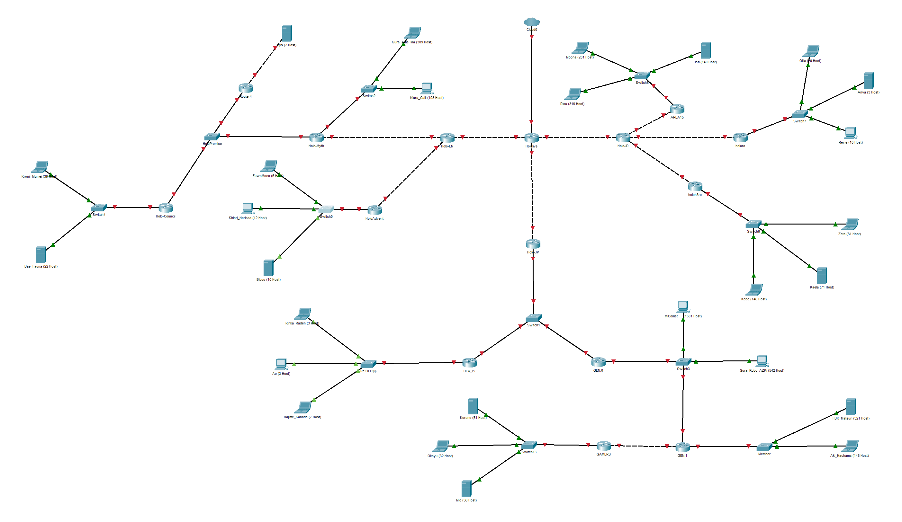
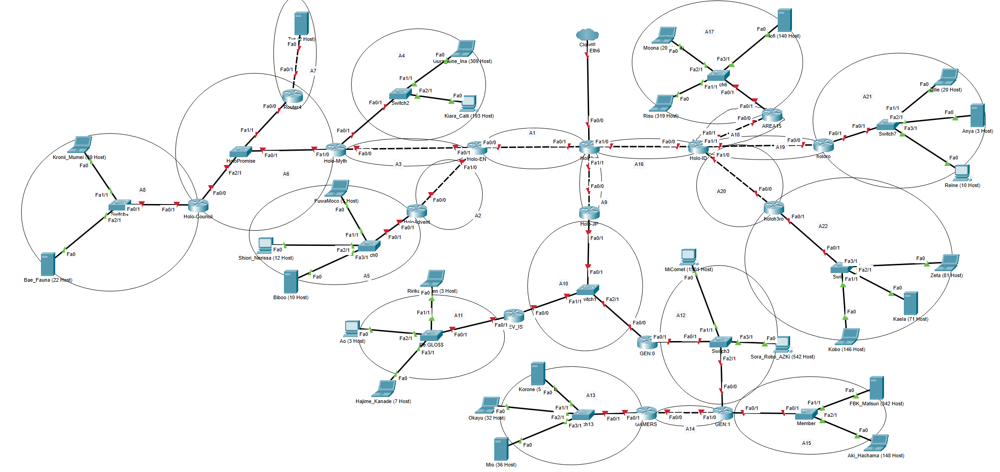

# Jarkom-Modul-4-IT07-2024

Kelompok IT07:

- Dimas Andhika Diputra 5027231074
- Kharisma Fahrun Nisa 5027231086

# Topologi



# Rute

| Nama Subnet | Rute                                                                                                                                                  |
| ----------- | ----------------------------------------------------------------------------------------------------------------------------------------------------- |
| A1          | Hololive > Holo-EN                                                                                                                                    |
| A2          | Hololive > Holo-EN > HoloAdvent                                                                                                                       |
| A3          | Hololive > Holo-EN > Holo-Myth                                                                                                                        |
| A4          | Hololive > Holo-EN > Holo-Myth > Switch2 > Gura_Aine_Ina (309 Host) > Switch2 > Kiara_Calli (193 Host)                                                |
| A5          | Hololive > Holo-EN > HoloAdvent > Switch0 > FuwaMoco (5 Host) > Switch0 > Shiori_Nerissa (12 Host) > Switch0 > Biboo (10 Host)                        |
| A6          | Hololive > Holo-EN > Holo-Myth > HoloPromise > Router4 > HoloPromise > Holo-Council                                                                   |
| A7          | Hololive > Holo-EN > Holo-Myth > HoloPromise > Router4 > Tys (2 Host)                                                                                 |
| A8          | Hololive > Holo-EN > Holo-Myth > HoloPromise > Holo-Council > Switch4 > Kronii_Mumei (39 Host) > Switch4 > Bae_Fauna (22 Host)                        |
| A9          | Hololive > Holo-JP                                                                                                                                    |
| A10         | Hololive > Holo-JP > Switch1 > DEV_IS > Switch1 > GEN:0                                                                                               |
| A11         | Hololive > Holo-JP > Switch1 > DEV_IS > `Re:GLO$$` > Ririka_Raden (3 Host) > `Re:GLO$$` > Ao (3 Host) > `Re:GLO$$` > Hajime_Kanade (7 Host)           |
| A12         | Hololive > Holo-JP > Switch1 > GEN:0 > Switch3 > MiComet (1501 Host) > Switch3 > Sora_Robo_AZKi (542 Host) > Switch3 > GEN:1                          |
| A13         | Hololive > Holo-JP > Switch1 > GEN:0 > Switch3 > GEN:1 > GAMERS                                                                                       |
| A14         | Hololive > Holo-JP > Switch1 > GEN:0 > Switch3 > GEN:1 > GAMERS > Switch13 > Korone (51 Host) > Switch13 > Okayu (32 Host) > Switch13 > Mio (36 Host) |
| A15         | Hololive > Holo-JP > Switch1 > GEN:0 > Switch3 > GEN:1 > Member > FBK_Matsuri (342 Host) > Member > Aki_Hachama (148 Host)                            |
| A16         | Hololive > Holo-ID                                                                                                                                    |
| A17         | Hololive > Holo-ID > AREA15                                                                                                                           |
| A18         | Hololive > Holo-ID > AREA15 > Switch6 > lofi (140 Host) > Switch6 > Risu (319 Host) > Switch6 > Moona (201 Host)                                      |
| A19         | Hololive > Holo-ID > holoro                                                                                                                           |
| A20         | Hololive > Holo-ID > holoh3ro                                                                                                                         |
| A21         | Hololive > Holo-ID > holoh3ro > Switch8 > Zeta (81 Host) > Switch8 > Kaela (71 Host) > Switch8 > Kobo (146 Host)                                      |
| A22         | Hololive > Holo-ID > holoro > Switch7 > Ollie (20 Host) > Switch7 > Anya (3 Host) > Switch7 > Reine (10 Host))                                        |

# Area Subnet

| Nama Subnet | Area Subnet                                                                           | Jumlah IP | Netmask |
| ----------- | ------------------------------------------------------------------------------------- | --------- | ------- |
| A1          | Hololive - Holo-EN                                                                    | 2         | /30     |
| A2          | Holo-EN - HoloAdvent                                                                  | 2         | /30     |
| A3          | Holo-EN - Holo-Myth                                                                   | 2         | /30     |
| A4          | Holo-Myth - Switch2 - Gura_Aine_Ina (309 Host) - Kiara_Calli (193 Host)               | 503       | /23     |
| A5          | HoloAdvent - Switch0 - FuwaMoco (5 Host) - Shiori_Nerissa (12 Host) - Biboo (10 Host) | 28        | /27     |
| A6          | Holo-Myth - HoloPromise - Router4 - Holo-Council                                      | 3         | /29     |
| A7          | Router4 - Tys (2 Host)                                                                | 3         | /29     |
| A8          | Holo-Council - Switch4 - Kronii_Mumei (39 Host) - Bae_Fauna (22 Host)                 | 62        | /26     |
| A9          | Hololive - Holo-JP                                                                    | 2         | /30     |
| A10         | Holo-JP - Switch1 - DEV_IS - GEN:0                                                    | 3         | /29     |
| A11         | DEV_IS - `Re:GLO$$` - Ririka_Raden (3 Host) - Ao (3 Host) - Hajime_Kanade (7 Host)    | 14        | /28     |
| A12         | GEN:0 - Switch3 - MiComet (1501 Host) - Sora_Robo_AZKi (542 Host) - GEN:1             | 2045      | /21     |
| A13         | GEN:1 - GAMERS                                                                        | 2         | /30     |
| A14         | GAMERS - Switch13 - Korone (51 Host) - Okayu (32 Host) - Mio (36 Host)                | 120       | /25     |
| A15         | GEN:1 - Member - FBK_Matsuri (321 Host) - Aki_Hachama (148 Host)                      | 470       | /23     |
| A16         | Hololive - Holp-ID                                                                    | 2         | /30     |
| A17         | Holo-ID - AREA15                                                                      | 2         | /30     |
| A18         | AREA15 - Switch6 - Risu (319 Host) - Moona (201 Host) - lofi (140 Host)               | 661       | /22     |
| A19         | Holo-ID - holoro                                                                      | 2         | /30     |
| A20         | Holo-ID - holoh3ro                                                                    | 2         | /30     |
| A21         | holoh3ro - Switch8 - Zeta (81 Host) - Kaela (71 Host) - Kobo (146 Host)               | 299       | /23     |
| A22         | holoro - Switch7 - Ollie (20 Host) - Anya (3 Host) - Reine (10 Host)                  | 34        | /26     |
| Total       |                                                                                       | 4263      | /19     |

# CPT VLSM

## Topologi



## Pembagian IP

Prefix IP: 10.67.xx.xx

| Subnet | Network ID   | Netmask               | Broadcast    | Range IP (Usable)           |
| ------ | ------------ | --------------------- | ------------ | --------------------------- |
| A12    | 10.67.0.0    | 255.255.248.0 (/21)   | 10.67.7.255  | 10.67.0.1 - 10.67.7.254     |
| A18    | 10.67.8.0    | 255.255.252.0 (/22)   | 10.67.11.255 | 10.67.8.1 - 10.67.11.254    |
| A15    | 10.67.12.0   | 255.255.254.0 (/23)   | 10.67.13.255 | 10.67.12.1 - 10.67.13.254   |
| A21    | 10.67.14.0   | 255.255.254.0 (/23)   | 10.67.15.255 | 10.67.14.1 - 10.67.15.254   |
| A4     | 10.67.16.0   | 255.255.254.0 (/23)   | 10.67.17.255 | 10.67.16.1 - 10.67.17.254   |
| A8     | 10.67.18.0   | 255.255.255.192 (/26) | 10.67.18.63  | 10.67.18.1 - 10.67.18.62    |
| A22    | 10.67.18.64  | 255.255.255.192 (/26) | 10.67.18.127 | 10.67.18.65 - 10.67.18.126  |
| A14    | 10.67.19.0   | 255.255.255.128 (/25) | 10.67.19.127 | 10.67.19.1 - 10.67.19.126   |
| A5     | 10.67.19.128 | 255.255.255.224 (/27) | 10.67.19.159 | 10.67.19.129 - 10.67.19.158 |
| A11    | 10.67.19.160 | 255.255.255.240 (/28) | 10.67.19.175 | 10.67.19.161 - 10.67.19.174 |
| A6     | 10.67.19.176 | 255.255.255.248 (/29) | 10.67.19.183 | 10.67.19.177 - 10.67.19.182 |
| A7     | 10.67.19.184 | 255.255.255.248 (/29) | 10.67.19.191 | 10.67.19.185 - 10.67.19.190 |
| A10    | 10.67.19.192 | 255.255.255.248 (/29) | 10.67.19.199 | 10.67.19.193 - 10.67.19.198 |
| A1     | 10.67.19.200 | 255.255.255.252 (/30) | 10.67.19.203 | 10.67.19.201 - 10.67.19.202 |
| A2     | 10.67.19.204 | 255.255.255.252 (/30) | 10.67.19.207 | 10.67.19.205 - 10.67.19.206 |
| A3     | 10.67.19.208 | 255.255.255.252 (/30) | 10.67.19.211 | 10.67.19.209 - 10.67.19.210 |
| A9     | 10.67.19.212 | 255.255.255.252 (/30) | 10.67.19.215 | 10.67.19.213 - 10.67.19.214 |
| A13    | 10.67.19.216 | 255.255.255.252 (/30) | 10.67.19.219 | 10.67.19.217 - 10.67.19.218 |
| A16    | 10.67.19.220 | 255.255.255.252 (/30) | 10.67.19.223 | 10.67.19.221 - 10.67.19.222 |
| A17    | 10.67.19.224 | 255.255.255.252 (/30) | 10.67.19.227 | 10.67.19.225 - 10.67.19.226 |
| A19    | 10.67.19.228 | 255.255.255.252 (/30) | 10.67.19.231 | 10.67.19.229 - 10.67.19.230 |
| A20    | 10.67.19.232 | 255.255.255.252 (/30) | 10.67.19.235 | 10.67.19.233 - 10.67.19.234 |

Total alokasi IP ini diurutkan berdasarkan jumlah host terbesar hingga terkecil.

## Tree

## Konfigurasi Subnetting

### **Subnet A1**

#### Hololive (Router)

```
interface fa0/1
ip address 10.67.19.201 255.255.255.252
no shutdown
```

#### Holo-EN (Router)

```
interface fa0/0
ip address 10.67.19.202 255.255.255.252
no shutdown
```

### **Subnet A2**

#### Holo-EN (Router)

```
interface fa1/0
ip address 10.67.19.205 255.255.255.252
no shutdown
```

#### HoloAdvent (Router)

```
interface fa0/0
ip address 10.67.19.206 255.255.255.252
no shutdown
```

### **Subnet A3**

#### Holo-EN (Router)

```
interface fa0/1
ip address 10.67.19.209 255.255.255.252
no shutdown
```

#### Holo-Myth (Router)

```
interface fa0/0
ip address 10.67.19.210 255.255.255.252
no shutdown
```

### **Subnet A4**

#### Holo-Myth (Router)

```
interface fa0/0
ip address 10.67.16.1 255.255.254.0
no shutdown
```

#### Gura_Aine_Ina (309 Host) (Client)

```
Interface fa0
IP Address: 10.67.16.2
Subnet Mask: 255.255.254.0
Gateway: 10.67.16.1
```

#### Kiara_Calli (193 Host) (Client)

```
Interface fa0
IP Address: 10.67.16.3
Subnet Mask: 255.255.254.0
Gateway: 10.67.16.1
```

### **Subnet A5**

#### HoloAdvent (Router)

```
interface fa0/1
ip address 10.67.19.129 255.255.255.224
no shutdown
```

#### FuwaMoco (5 Host) (Client)

```
Interface fa0
IP Address: 10.67.19.130
Subnet Mask: 255.255.255.224
Gateway: 10.67.19.129
```

#### Shiori_Nerissa (12 Host) (Client)

```
Interface fa0
IP Address: 10.67.19.131
Subnet Mask: 255.255.255.224
Gateway: 10.67.19.129
```

#### Biboo (10 Host) (Client)

```
Interface fa0
IP Address: 10.67.19.132
Subnet Mask: 255.255.255.224
Gateway: 10.67.19.129
```

### **Subnet A6**

#### HoloAdvent (Router)

```
interface fa1/0
ip address 10.67.19.177 255.255.255.248
no shutdown
```

#### Router4 (Router)

```
interface fa0/0
ip address 10.67.19.179 255.255.255.248
no shutdown
```

#### Holo-Council (Router)

```
interface fa0/0
ip address 10.67.19.178 255.255.255.248
no shutdown
```

### **Subnet A7**

#### Router4 (Router)

```
interface fa0/1
ip address 10.67.19.185 255.255.255.248
no shutdown
```

#### Tys (2 Host) (Client)

```
Interface fa0
IP Address: 10.67.19.186
Subnet Mask: 255.255.255.248
Gateway: 10.67.19.185
```

### **Subnet A8**

#### Holo-Council (Router)

```
interface fa0/1
ip address 10.67.18.1 255.255.255.192
no shutdown
```

#### Kronii_Mumei (39 Host) (Client)

```
Interface fa0
IP Address: 10.67.18.2
Subnet Mask: 255.255.255.192
Gateway: 10.67.18.1
```

#### Bae_Fauna (22 Host) (Client)

```
Interface fa0
IP Address: 10.67.18.3
Subnet Mask: 255.255.255.192
Gateway: 10.67.18.1
```

### **Subnet A9**

#### Hololive (Router)

```
interface fa1/1
ip address 10.67.19.213 255.255.255.252
no shutdown
```

#### Holo-JP (Router)

```
interface fa0/0
ip address 10.67.19.214 255.255.255.252
no shutdown
```

### **Subnet A10**

#### Holo-JP (Router)

```
interface fa0/1
ip address 10.67.19.193 255.255.255.248
no shutdown
```

#### DEV_IS (Router)

```
interface fa0/0
ip address 10.67.19.194 255.255.255.248
no shutdown
```

#### GEN:0 (Router)

```
interface fa0/0
ip address 10.67.19.195 255.255.255.248
no shutdown
```

### **Subnet A11**

#### DEV_IS (Router)

```
interface fa0/1
ip address 10.67.19.161 255.255.255.240
no shutdown
```

#### Ririka_Raden (3 Host) (Client)

```
Interface fa0
IP Address: 10.67.19.162
Subnet Mask: 255.255.255.240
Gateway: 10.67.19.161
```

#### Ao (3 Host) (Client)

```
Interface fa0
IP Address: 10.67.19.163
Subnet Mask: 255.255.255.240
Gateway: 10.67.19.161
```

#### Hajime_Kanade (7 Host) (Client)

```
Interface fa0
IP Address: 10.67.19.164
Subnet Mask: 255.255.255.240
Gateway: 10.67.19.161
```

### **Subnet A12**

#### GEN:0 (Router)

```
interface fa0/1
ip address 10.67.0.1 255.255.248.0
no shutdown
```

#### GEN:1 (Router)

```
interface fa0/0
ip address 10.67.0.4 255.255.248.0
no shutdown
```

#### MiComet (1501 Host) (Client)

```
Interface fa0
IP Address: 10.67.0.2
Subnet Mask: 255.255.248.0
Gateway: 10.67.0.1
```

#### Sora_Robo_AZKi (542 Host) (Client)

```
Interface fa0
IP Address: 10.67.0.3
Subnet Mask: 255.255.248.0
Gateway: 10.67.0.1
```

### **Subnet A13**

#### GEN:1 (Router)

```
interface fa1/0
ip address 10.67.19.217 255.255.255.252
no shutdown
```

#### GAMERS (Router)

```
interface fa0/0
ip address 10.67.19.218 255.255.255.252
no shutdown
```

### **Subnet A14**

#### GAMERS (Router)

```
interface fa0/0
ip address 10.67.19.1 255.255.255.128
no shutdown
```

#### Korone (51 Host) (Client)

```
Interface fa0
IP Address: 10.67.19.2
Subnet Mask: 255.255.255.128
Gateway: 10.67.19.1
```

#### Okayu (32 Host) (Client)

```
Interface fa0
IP Address: 10.67.19.3
Subnet Mask: 255.255.255.128
Gateway: 10.67.19.1
```

#### Mio (36 Host) (Client)

```
Interface fa0
IP Address: 10.67.19.4
Subnet Mask: 255.255.255.128
Gateway: 10.67.19.1
```

### **Subnet A15**

#### GEN:1 (Router)

```
interface fa0/1
ip address 10.67.12.1 255.255.254.0
no shutdown
```

#### FBK_Matsuri (342 Host) (Client)

```
Interface fa0
IP Address: 10.67.12.2
Subnet Mask: 255.255.254.0
Gateway: 10.67.12.1
```

#### Aki_Hachama (148 Host) (Client)

```
Interface fa0
IP Address: 10.67.12.3
Subnet Mask: 255.255.254.0
Gateway: 10.67.12.1
```

### **Subnet A16**

#### Hololive (Router)

```
interface fa1/0
ip address 10.67.19.221 255.255.255.252
no shutdown
```

#### Holo-ID (Router)

```
interface fa0/0
ip address 10.67.19.222 255.255.255.252
no shutdown
```

### **Subnet A17**

#### Holo-ID (Router)

```
interface fa0/1
ip address 10.67.19.225 255.255.255.252
no shutdown
```

#### AREA15 (Router)

```
interface fa0/0
ip address 10.67.19.226 255.255.255.252
no shutdown
```

### **Subnet A18**

#### AREA15 (Router)

```
interface fa0/1
ip address 10.67.8.1 255.255.252.0
no shutdown
```

#### lofi (140 Host) (Client)

```
Interface fa0
IP Address: 10.67.8.2
Subnet Mask: 255.255.252.0
Gateway: 10.67.8.1
```

#### Moona (201 Host) (Client)

```
Interface fa0
IP Address: 10.67.8.3
Subnet Mask: 255.255.252.0
Gateway: 10.67.8.1
```

#### Risu (319 Host) (Client)

```
Interface fa0
IP Address: 10.67.8.4
Subnet Mask: 255.255.252.0
Gateway: 10.67.8.1
```

### **Subnet A19**

#### Holo-ID (Router)

```
interface fa1/1
ip address 10.67.19.229 255.255.255.252
no shutdown
```

#### holoro (Router)

```
interface fa0/0
ip address 10.67.19.230 255.255.255.252
no shutdown
```

### **Subnet A20**

#### Holo-ID (Router)

```
interface fa1/0
ip address 10.67.19.233 255.255.255.252
no shutdown
```

#### holoh3ro (Router)

```
interface fa0/0
ip address 10.67.19.234 255.255.255.252
no shutdown
```

### **Subnet A21**

#### holoh3ro (Router)

```
interface fa0/1
ip address 10.67.14.1 255.255.254.0
no shutdown
```

#### Kobo (146 Host) (Client)

```
Interface fa0
IP Address: 10.67.14.2
Subnet Mask: 255.255.254.0
Gateway: 10.67.14.1
```

#### Kaela (71 Host) (Client)

```
Interface fa0
IP Address: 10.67.14.3
Subnet Mask: 255.255.254.0
Gateway: 10.67.14.1
```

#### Zeta (81 Host) (Client)

```
Interface fa0
IP Address: 10.67.14.4
Subnet Mask: 255.255.254.0
Gateway: 10.67.14.1
```

### **Subnet A22**

#### holoro (Router)

```
interface fa0/1
ip address 10.67.18.65 255.255.255.192
no shutdown
```

#### Reine (10 Host) (Client)

```
Interface fa0
IP Address: 10.67.18.66
Subnet Mask: 255.255.255.192
Gateway: 10.67.18.65
```

#### Anya (3 Host) (Client)

```
Interface fa0
IP Address: 10.67.18.67
Subnet Mask: 255.255.255.192
Gateway: 10.67.18.65
```

#### Ollie (20 Host) (Client)

```
Interface fa0
IP Address: 10.67.18.68
Subnet Mask: 255.255.255.192
Gateway: 10.67.18.65
```
