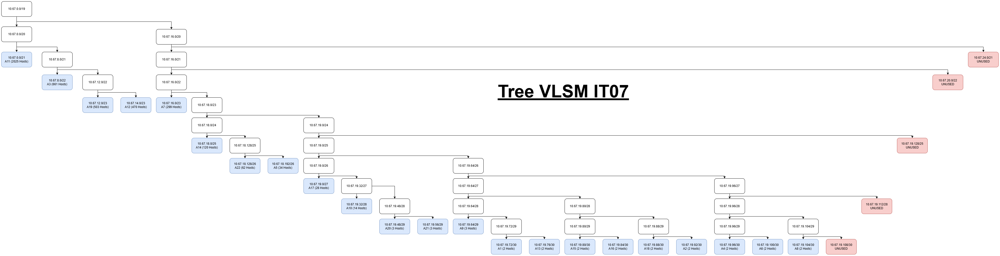

# Jarkom-Modul-4-IT07-2024

- Dimas Andhika Diputra (5027231074)
- Kharisma Fahrun Nisa (5027231086)

## Topologi

#### Topologi CPT VLSM


## Routing Table

| Nama Subnet | Rute                                                                                             | Jumlah IP | Netmask |
| ----------- | ------------------------------------------------------------------------------------------------ | --------- | ------- |
| A1          | Hololive > Holo-ID                                                                               | 2         | /30     |
| A2          | Hololive > Holo-ID > AREA-15                                                                     | 2         | /30     |
| A3          | Hololive > Holo-ID > AREA-15 > Switch6 > Moona + Risu + lofi                                     | 661       | /22     |
| A4          | Hololive > Holo-ID > holoro                                                                      | 2         | /30     |
| A5          | Hololive > Holo-ID > holoro > Switch7 > Ollie + Anya + Reine                                     | 34        | /26     |
| A6          | Hololive > Holo-ID > holoh3ro                                                                    | 2         | /30     |
| A7          | Hololive > Holo-ID > holoh3ro > Switch8 > Zeta + Kaela + Kobo                                    | 299       | /23     |
| A8          | Hololive > Holo-JP                                                                               | 2         | /30     |
| A9          | Hololive > Holo-JP > Switch1 > DEV_IS + GEN:0                                                    | 3         | /29     |
| A10         | Hololive > Holo-JP > Switch1 > DEV_IS > Re:Gloss > Ririka_Raden + Ao + Hajime_Kanade             | 14        | /28     |
| A11         | Hololive > Holo-JP > Switch1 > GEN:0 > Switch3 > MiComet + Sora_Robo_AZK + GEN:1                 | 2045      | /21     |
| A12         | Hololive > Holo-JP > Switch1 > GEN:0 > Switch3 > GEN:1 > Member > FBK_Matsuri + Aki_Hachama      | 470       | /23     |
| A13         | Hololive > Holo-JP > Switch1 > GEN:0 > Switch3 > GEN:1 > GAMERS                                  | 2         | /30     |
| A14         | Hololive > Holo-JP > Switch1 > GEN:0 > Switch3 > GEN:1 > GAMERS > Fubuki > Korone + Okayu + Mio  | 120       | /25     |
| A15         | Hololive > Holo-EN                                                                               | 2         | /30     |
| A16         | Hololive > Holo-EN > HoloAdvent                                                                  | 2         | /30     |
| A17         | Hololive > Holo-EN > HoloAdvent > Switch0 > FuwaMoco + Shiori_Nerissa + Biboo                    | 28        | /27     |
| A18         | Hololive > Holo-EN > Holo-Myth                                                                   | 2         | /30     |
| A19         | Hololive > Holo-EN > Holo-Myth > Switch2 > Gura_Ame_Ina + Kiara_Calli                            | 503       | /23     |
| A20         | Hololive > Holo-EN > Holo-Myth > HoloPromise > Router4 + Holo_Council                            | 3         | /29     |
| A21         | Hololive > Holo-EN > Holo-Myth > HoloPromise > Router4 > Tys                                     | 3         | /29     |
| A22         | Hololive > Holo-EN > Holo-Myth > HoloPromise > Holo-Council > Switch4 > Kronii_Mumei + Bae_Fauna | 62        | /26     |
| Total       |                                                                                                  | 4263      | /19     |

## Subnetting Cisco Packet Tracer - Metode VLSM

### Tree VLSM



### Pembagian IP

| Subnet | Network ID   | Netmask         | Broadcast    | Range IP                    |
| ------ | ------------ | --------------- | ------------ | --------------------------- |
| A1     | 10.67.19.72  | 255.255.255.252 | 10.67.19.75  | 10.67.19.73 - 10.67.19.74   |
| A2     | 10.67.19.92  | 255.255.255.252 | 10.67.19.95  | 10.67.19.93 - 10.67.19.94   |
| A3     | 10.67.8.0    | 255.255.252.0   | 10.67.11.255 | 10.67.8.1 - 10.67.11.254    |
| A4     | 10.67.19.96  | 255.255.255.252 | 10.67.19.99  | 10.67.19.97 - 10.67.19.98   |
| A5     | 10.67.18.192 | 255.255.255.192 | 10.67.18.255 | 10.67.18.193 - 10.67.18.254 |
| A6     | 10.67.19.100 | 255.255.255.252 | 10.67.19.103 | 10.67.19.101 - 10.67.19.102 |
| A7     | 10.67.16.0   | 255.255.254.0   | 10.67.17.255 | 10.67.16.1 - 10.67.17.254   |
| A8     | 10.67.19.104 | 255.255.255.252 | 10.67.19.107 | 10.67.19.105 - 10.67.19.106 |
| A9     | 10.67.19.64  | 255.255.255.248 | 10.67.19.71  | 10.67.19.65 - 10.67.19.70   |
| A10    | 10.67.19.32  | 255.255.255.240 | 10.67.19.47  | 10.67.19.33 - 10.67.19.46   |
| A11    | 10.67.0.0    | 255.255.248.0   | 10.67.7.255  | 10.67.0.1 - 10.67.7.254     |
| A12    | 10.67.14.0   | 255.255.254.0   | 10.67.15.255 | 10.67.14.1 - 10.67.15.254   |
| A13    | 10.67.19.76  | 255.255.255.252 | 10.67.19.79  | 10.67.19.77 - 10.67.19.78   |
| A14    | 10.67.18.0   | 255.255.255.128 | 10.67.18.127 | 10.67.18.1 - 10.67.18.126   |
| A15    | 10.67.19.80  | 255.255.255.252 | 10.67.19.83  | 10.67.19.81 - 10.67.19.82   |
| A16    | 10.67.19.84  | 255.255.255.252 | 10.67.19.87  | 10.67.19.85 - 10.67.19.86   |
| A17    | 10.67.19.0   | 255.255.255.224 | 10.67.19.31  | 10.67.19.1 - 10.67.19.30    |
| A18    | 10.67.19.88  | 255.255.255.252 | 10.67.19.91  | 10.67.19.89 - 10.67.19.90   |
| A19    | 10.67.12.0   | 255.255.254.0   | 10.67.13.255 | 10.67.12.1 - 10.67.13.254   |
| A20    | 10.67.19.48  | 255.255.255.248 | 10.67.19.55  | 10.67.19.49 - 10.67.19.54   |
| A21    | 10.67.19.56  | 255.255.255.248 | 10.67.19.63  | 10.67.19.57 - 10.67.19.62   |
| A22    | 10.67.18.128 | 255.255.255.192 | 10.67.18.191 | 10.67.18.129 - 10.67.18.190 |

### Konfigurasi Subnetting

#### Subnet A1

**Hololive (Router)**

```
enable
configure terminal
interface fa1/0
ip address 10.67.19.73 255.255.255.252
no shutdown
```

**Holo-ID (Router)**

```
enable
configure terminal
interface fa0/0
ip address 10.67.19.74 255.255.255.252
no shutdown
```

#### Subnet A2

**Holo-ID (Router)**

```
enable
configure terminal
interface fa0/1
ip address 10.67.19.93 255.255.255.252
no shutdown
```

**AREA15 (Router)**

```
enable
configure terminal
interface fa0/0
ip address 10.67.19.94 255.255.255.252
no shutdown
```

#### Subnet A3

**AREA15 (Router)**

```
enable
configure terminal
interface fa0/1
ip address 10.67.8.1 255.255.252.0
no shutdown
```

**Moona (Device)**

```
Interface fa0
IP Address: 10.67.8.2
Subnet Mask: 255.255.252.0
Gateway: 10.67.8.1
```

**Risu (Device)**

```
Interface fa0
IP Address: 10.67.8.3
Subnet Mask: 255.255.252.0
Gateway: 10.67.8.1
```

**lofi (Device)**

```
Interface fa0
IP Address: 10.67.8.4
Subnet Mask: 255.255.252.0
Gateway: 10.67.8.1
```

#### Subnet A4

**Holo-ID (Router)**

```
enable
configure terminal
interface fa1/1
ip address 10.67.19.97 255.255.255.252
no shutdown
```

**holoro (Router)**

```
enable
configure terminal
interface fa0/0
ip address 10.67.19.98 255.255.255.252
no shutdown
```

#### Subnet A5

**holoro (Router)**

```
enable
configure terminal
interface fa0/1
ip address 10.67.18.193 255.255.255.192
no shutdown
```

**Ollie (Device)**

```
Interface fa0
IP Address: 10.67.18.194
Subnet Mask: 255.255.255.192
Gateway: 10.67.18.193
```

**Anya (Device)**

```
Interface fa0
IP Address: 10.67.18.195
Subnet Mask: 255.255.255.192
Gateway: 10.67.18.193
```

**Reine (Device)**

```
Interface fa0
IP Address: 10.67.18.196
Subnet Mask: 255.255.255.192
Gateway: 10.67.18.193
```

#### Subnet A6

**Holo-ID (Router)**

```
enable
configure terminal
interface fa1/0
ip address 10.67.19.101 255.255.255.252
no shutdown
```

**holoh3ro (Router)**

```
enable
configure terminal
interface fa0/0
ip address 10.67.19.102 255.255.255.252
no shutdown
```

#### Subnet A7

**holoh3ro (Router)**

```
enable
configure terminal
interface fa0/1
ip address 10.67.16.1 255.255.254.0
no shutdown
```

**Zeta (Device)**

```
Interface fa0
IP Address: 10.67.16.2
Subnet Mask: 255.255.254.0
Gateway: 10.67.16.1
```

**Kaela (Device)**

```
Interface fa0
IP Address: 10.67.16.3
Subnet Mask: 255.255.254.0
Gateway: 10.67.16.1
```

**Kobo (Device)**

```
Interface fa0
IP Address: 10.67.16.4
Subnet Mask: 255.255.254.0
Gateway: 10.67.16.1
```

#### Subnet A8

**Hololive (Router)**

```
enable
configure terminal
interface fa1/1
ip address 10.67.19.105 255.255.255.252
no shutdown
```

**Holo-JP (Router)**

```
enable
configure terminal
interface fa0/0
ip address 10.67.19.106 255.255.255.252
no shutdown
```

#### Subnet A9

**Holo-JP (Router)**

```
enable
configure terminal
interface fa0/1
ip address 10.67.19.65 255.255.255.248
no shutdown
```

**DEV_IS (Router)**

```
enable
configure terminal
interface fa0/0
ip address 10.67.19.66 255.255.255.248
no shutdown
```

**GEN:0 (Router)**

```
enable
configure terminal
interface fa0/0
ip address 10.67.19.67 255.255.255.248
no shutdown
```

#### Subnet A10

**DEV_IS (Router)**

```
enable
configure terminal
interface fa0/1
ip address 10.67.19.33 255.255.255.240
no shutdown
```

**Ririka_Rade (Device)**

```
Interface fa0
IP Address: 10.67.19.34
Subnet Mask: 255.255.255.240
Gateway: 10.67.19.33
```

**Ao (Device)**

```
Interface fa0
IP Address: 10.67.19.35
Subnet Mask: 255.255.255.240
Gateway: 10.67.19.33
```

**Hajime_Kanade (Device)**

```
Interface fa0
IP Address: 10.67.19.36
Subnet Mask: 255.255.255.240
Gateway: 10.67.19.33
```

#### Subnet A11

**GEN:0 (Router)**

```
enable
configure terminal
interface fa0/1
ip address 10.67.0.1 255.255.248.0
no shutdown
```

**GEN:1 (Router)**

```
enable
configure terminal
interface fa0/0
ip address 10.67.0.2 255.255.248.0
no shutdown
```

**MiComet (Device)**

```
Interface fa0
IP Address: 10.67.0.3
Subnet Mask: 255.255.248.0
Gateway: 10.67.0.1
```

**Sora_Robo_AZK (Device)**

```
Interface fa0
IP Address: 10.67.0.4
Subnet Mask: 255.255.248.0
Gateway: 10.67.0.1
```

#### Subnet A12

**GEN:1 (Router)**

```
enable
configure terminal
interface fa0/1
ip address 10.67.14.1 255.255.254.0
no shutdown
```

**FBK_Matsuri (Device)**

```
Interface fa0
IP Address: 10.67.14.2
Subnet Mask: 255.255.254.0
Gateway: 10.67.14.1
```

**Aki_Hachama (Device)**

```
Interface fa0
IP Address: 10.67.14.3
Subnet Mask: 255.255.254.0
Gateway: 10.67.14.1
```

#### Subnet A13

**GEN:1 (Router)**

```
enable
configure terminal
interface fa1/0
ip address 10.67.19.77 255.255.255.252
no shutdown
```

**GAMERS (Router)**

```
enable
configure terminal
interface fa0/0
ip address 10.67.19.78 255.255.255.252
no shutdown
```

#### Subnet A14

**GAMERS (Router)**

```
enable
configure terminal
interface fa0/1
ip address 10.67.18.1 255.255.255.128
no shutdown
```

**Kerone (Device)**

```
Interface fa0
IP Address: 10.67.18.2
Subnet Mask: 255.255.255.128
Gateway: 10.67.18.1
```

**Okayu (Device)**

```
Interface fa0
IP Address: 10.67.18.3
Subnet Mask: 255.255.255.128
Gateway: 10.67.18.1
```

**Mio (Device)**

```
Interface fa0
IP Address: 10.67.18.4
Subnet Mask: 255.255.255.128
Gateway: 10.67.18.1
```

#### Subnet A15

**Hololive (Router)**

```
enable
configure terminal
interface fa0/1
ip address 10.67.19.81 255.255.255.252
no shutdown
```

**Holo-EN (Router)**

```
enable
configure terminal
interface fa0/0
ip address 10.67.19.82 255.255.255.252
no shutdown
```

#### Subnet A16

**Holo-EN (Router)**

```
enable
configure terminal
interface fa1/0
ip address 10.67.19.85 255.255.255.252
no shutdown
```

**HoloAdvent (Router)**

```
enable
configure terminal
interface fa0/0
ip address 10.67.19.86 255.255.255.252
no shutdown
```

#### Subnet A17

**HoloAdvent (Router)**

```
enable
configure terminal
interface fa0/1
ip address 10.67.19.1 255.255.255.224
no shutdown
```

**FuwaMoco (Device)**

```
Interface fa0
IP Address: 10.67.19.2
Subnet Mask: 255.255.224.0
Gateway: 10.67.19.1
```

**Shiori_Nerissa (Device)**

```
Interface fa0
IP Address: 10.67.19.3
Subnet Mask: 255.255.224.0
Gateway: 10.67.19.1
```

**Biboo (Device)**

```
Interface fa0
IP Address: 10.67.19.4
Subnet Mask: 255.255.224.0
Gateway: 10.67.19.1
```

#### Subnet A18

**Holo-EN (Router)**

```
enable
configure terminal
interface fa0/1
ip address 10.67.19.89 255.255.255.252
no shutdown
```

**Holo-Myth (Router)**

```
enable
configure terminal
interface fa0/0
ip address 10.67.19.90 255.255.255.252
no shutdown
```

#### Subnet A19

**Holo-Myth (Router)**

```
enable
configure terminal
interface fa0/1
ip address 10.67.12.1 255.255.254.0
no shutdown
```

**Gura_Ame_Ina (Device)**

```
Interface fa0
IP Address: 10.67.12.2
Subnet Mask: 255.255.254.0
Gateway: 10.67.12.1
```

**Kiara_Calli (Device)**

```
Interface fa0
IP Address: 10.67.12.3
Subnet Mask: 255.255.254.0
Gateway: 10.67.12.1
```

#### Subnet A20

**Holo-Myth (Router)**

```
enable
configure terminal
interface fa1/0
ip address 10.67.19.49 255.255.255.248
no shutdown
```

**Router4 (Router)**

```
enable
configure terminal
interface fa0/0
ip address 10.67.19.50 255.255.255.248
no shutdown
```

**Holo-Council (Router)**

```
enable
configure terminal
interface fa0/0
ip address 10.67.19.51 255.255.255.248
no shutdown
```

#### Subnet A21

**Router4 (Router)**

```
enable
configure terminal
interface fa0/1
ip address 10.67.19.57 255.255.255.248
no shutdown
```

**Tys (Device)**

```
Interface fa0
IP Address: 10.67.19.58
Subnet Mask: 255.255.255.248
Gateway: 10.67.19.57
```

#### Subnet A22

**Holo-Council (Router)**

```
enable
configure terminal
interface fa0/1
ip address 10.67.18.129 255.255.255.192
no shutdown
```

**Kronii_Mumei (Device)**

```
Interface fa0
IP Address: 10.67.18.130
Subnet Mask: 255.255.255.192
Gateway: 10.67.18.129
```

**Bae_Fauna (Device)**

```
Interface fa0
IP Address: 10.67.18.131
Subnet Mask: 255.255.255.192
Gateway: 10.67.18.129
```

### Konfigurasi Routing

#### Sisi Kanan (Holo-ID)

##### Hololive

```
enable
configure terminal
ip route 10.67.19.92 255.255.255.252 10.67.19.74
ip route 10.67.8.0 255.255.252.0 10.67.19.74
ip route 10.67.19.96 255.255.255.252 10.67.19.74
ip route 10.67.18.192 255.255.255.192 10.67.19.74
ip route 10.67.19.100 255.255.255.252 10.67.19.74
ip route 10.67.16.0 255.255.254.0 10.67.19.74
do write
```

##### Holo-ID

```
enable
configure terminal
ip route 0.0.0.0 0.0.0.0 10.67.19.73
ip route 10.67.8.0 255.255.252.0 10.67.19.94
ip route 10.67.18.192 255.255.255.192 10.67.19.98
ip route 10.67.16.0 255.255.254.0 10.67.19.102
do write
```

##### AREA15

```
enable
configure terminal
ip route 0.0.0.0 0.0.0.0 10.67.19.93
do write
```

##### holoro

```
enable
configure terminal
ip route 0.0.0.0 0.0.0.0 10.67.19.97
do write
```

##### holoh3ro

```
enable
configure terminal
ip route 0.0.0.0 0.0.0.0 10.67.19.101
do write
```

#### Sisi Bawah (Holo-JP)

##### Hololive

```
enable
configure terminal
ip route 10.67.19.64 255.255.255.248 10.67.19.106
ip route 10.67.19.32 255.255.255.240 10.67.19.106
ip route 10.67.0.0 255.255.248.0 10.67.19.106
ip route 10.67.14.0 255.255.254.0 10.67.19.106
ip route 10.67.19.76 255.255.255.252 10.67.19.106
ip route 10.67.18.0 255.255.255.128 10.67.19.106
do write
```

##### Holo-JP

```
enable
configure terminal
ip route 0.0.0.0 0.0.0.0 10.67.19.105
ip route 10.67.19.32 255.255.255.240 10.67.19.66
ip route 10.67.0.0 255.255.248.0 10.67.19.67
ip route 10.67.14.0 255.255.254.0 10.67.19.67
ip route 10.67.19.76 255.255.255.252 10.67.19.67
ip route 10.67.18.0 255.255.255.128 10.67.19.67
do write
```

##### DEV_IS

```
enable
configure terminal
ip route 0.0.0.0 0.0.0.0 10.67.19.65
ip route 10.67.0.0 255.255.248.0 10.67.19.67
ip route 10.67.14.0 255.255.254.0 10.67.19.67
ip route 10.67.19.76 255.255.255.252 10.67.19.67
ip route 10.67.18.0 255.255.255.128 10.67.19.67
do write
```

##### GEN:0

```
enable
configure terminal
ip route 0.0.0.0 0.0.0.0 10.67.19.65
ip route 10.67.19.32 255.255.255.240 10.67.19.66
ip route 10.67.14.0 255.255.254.0 10.67.0.2
ip route 10.67.19.76 255.255.255.252 10.67.0.2
ip route 10.67.18.0 255.255.255.128 10.67.0.2
do write
```

##### GEN:1

```
enable
configure terminal
ip route 0.0.0.0 0.0.0.0 10.67.0.1
ip route 10.67.18.0 255.255.255.128 10.67.19.78
do write
```

##### GAMERS

```
enable
configure terminal
ip route 0.0.0.0 0.0.0.0 10.67.19.77
do write
```

#### Sisi Kiri (Holo-EN)

##### Hololive

```
enable
configure terminal
ip route 10.67.19.84 255.255.255.252 10.67.19.82
ip route 10.67.19.0 255.255.255.224 10.67.19.82
ip route 10.67.19.88 255.255.255.252 10.67.19.82
ip route 10.67.12.0 255.255.254.0 10.67.19.82
ip route 10.67.19.48 255.255.255.248 10.67.19.82
ip route 10.67.19.56 255.255.255.248 10.67.19.82
ip route 10.67.18.128 255.255.255.192 10.67.19.82
do write
```

##### Holo-EN

```
enable
configure terminal
ip route 0.0.0.0 0.0.0.0 10.67.19.81
ip route 10.67.19.0 255.255.255.224 10.67.19.86
ip route 10.67.12.0 255.255.254.0 10.67.19.90
ip route 10.67.19.48 255.255.255.248 10.67.19.90
ip route 10.67.19.56 255.255.255.248 10.67.19.90
ip route 10.67.18.128 255.255.255.192 10.67.19.90
do write
```

##### HoloAdvent

```
enable
configure terminal
ip route 0.0.0.0 0.0.0.0 10.67.19.85
do write
```

##### Holo-Myth

```
enable
configure terminal
ip route 0.0.0.0 0.0.0.0 10.67.19.89
ip route 10.67.19.56 255.255.255.248 10.67.19.50
ip route 10.67.18.128 255.255.255.192 10.67.19.51
do write
```

##### Router4

```
enable
configure terminal
ip route 0.0.0.0 0.0.0.0 10.67.19.49
ip route 10.67.18.128 255.255.255.192 10.67.19.51
do write
```

##### Holo-Council

```
enable
configure terminal
ip route 0.0.0.0 0.0.0.0 10.67.19.49
ip route 10.67.19.56 255.255.255.248 10.67.19.50
do write
```

### Testing

testing dilakukan random dari 3 ujung topologi (sisi bawah, kanan, dan kiri) yaitu router (Holo-ID, Holo-JP, Holo-EN)

#### Router ke Router (testing routing)


#### Client ke Client (testing routing)


#### Testing Subnetting


